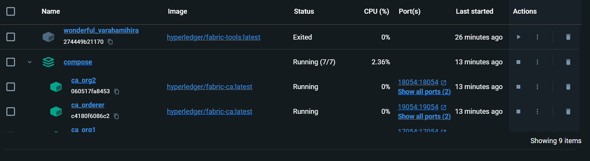
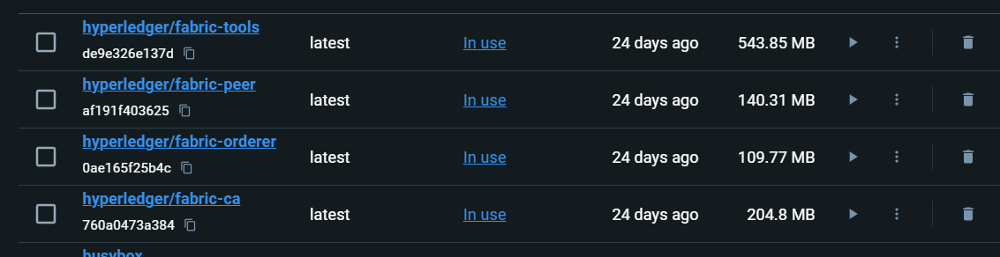
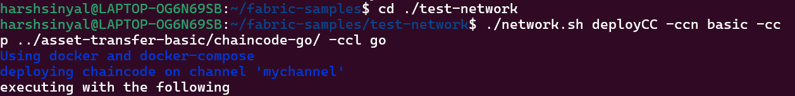
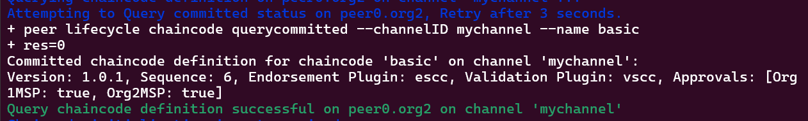

## SimplyFI_assignment

### 1. Steps for Installing and Instantiating the Chaincode on HLF2.2

#### Step 1: Installation


#### Step 2: Copy Chaincode to Docker Image


#### Step 3: Access Terminal in Docker Container


#### Step 4: Instantiate Chaincode on Channel


### 2. Explanation of Cryptogen and Configtxgen

Cryptogen and Configtxgen are two essential command-line tools provided by Hyperledger Fabric for setting up and configuring a Fabric network.

#### a. Cryptogen
Cryptogen is used to generate cryptographic materials necessary for establishing a Hyperledger Fabric network. It generates key pairs and X.509 certificates for various network entities such as organizations, peers, orderers, and more. This ensures secure communication and identity verification within the network.

Example usage:
```
cryptogen generate --config=./crypto-config.yaml
```


#### b. Configtxgen
Configtxgen is used to generate configuration artifacts required for creating and updating a Hyperledger Fabric network. It generates critical configuration components like the genesis block, channel configuration transactions, and anchor peer updates. These artifacts define the network's structure, policies, and consensus mechanisms.

Example usage:
```
configtxgen -profile MyChannel -outputCreateChannelTx ./channel-artifacts/mychannel.tx -channelID mychannel
```


### 3. Develop a Chaincode for Storing Data in Blockchain

#### Requirements:
- Store: Store data into the blockchain.
- Retrieve: Retrieve data from the blockchain.
- Update: Update existing data in the blockchain.
- GetHistory: Retrieve history of changes for a given ID.
- GetByNonPrimaryKey (Using CouchDB Rich Queries): Retrieve data based on a non-primary key, leveraging CouchDB rich queries.

### Have Only pushed Relevant Files for Question 3:
- chaincode.go: Contains the implementation of the chaincode functionalities.